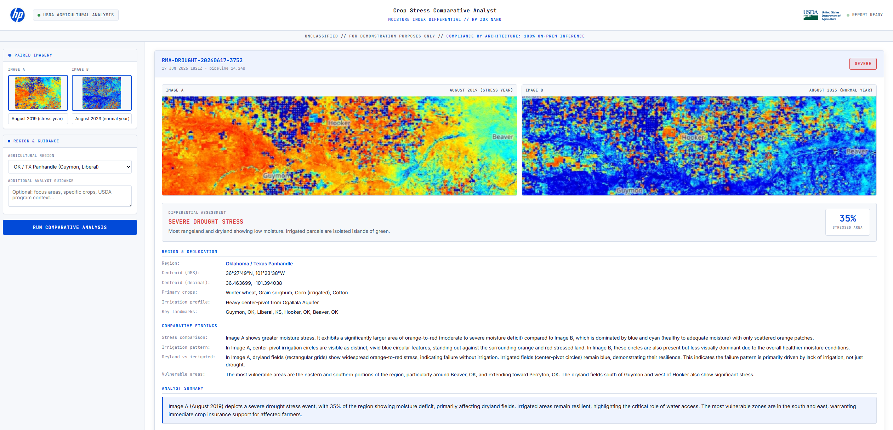

# USDA Crop Stress Analyst



**Comparative Moisture Index Analysis on the HP ZGX Nano**

A vision-language demo that takes two Sentinel-2 moisture index satellite images of the same agricultural region from different growing seasons, runs a comparative analysis in a single VLM forward pass, and produces a structured drought assessment with USDA program intervention recommendations.

Built for USDA customer engagements. Demonstrates **Compliance by Architecture** - sensitive agricultural imagery and analyst output never leave the HP ZGX Nano.

---

## What this demo proves

- **On-prem comparative vision-language reasoning** on the GB10 Grace Blackwell Superchip
- **Two images, one inference call** — the VLM does the differential analysis natively, not two stitched-together single-image classifications
- **Domain-specific output** mapped to real USDA programs: RMA crop insurance, FSA Livestock Forage Disaster Program, NRCS EQIP Drought Initiative, USDA Drought Monitor escalation
- **Zero cloud dependency** for an analysis class that would normally route sensitive ag data through commercial AI providers

## Stack

| Component | Detail |
|---|---|
| Hardware | HP ZGX Nano (NVIDIA GB10, sm_121, 128GB unified memory) |
| Container | `nvcr.io/nvidia/vllm:26.01-py3` |
| Inference | vLLM, OpenAI-compatible API on internal port 8090 |
| Model | Qwen3-VL-8B-Instruct-FP8 (~9GB) |
| App | FastAPI + plain HTML/JS, host port 8093 → container 8000 |
| Context | 8192 tokens (bumped from 4096 to fit two-image multimodal input) |

## Setup

```bash
# 1. Provision the model (~9GB, ~10-15 min if not already in HF cache)
./download_models.sh

# 2. Allow LAN access (one-time) if you run into network issues
sudo ufw allow 8093/tcp

# 3. Build and start (script polls until vLLM is fully loaded)
./start.sh --build -d

# 4. Verify
curl http://localhost:8093/api/health
```

First boot takes ~2-3 minutes for model loading. `start.sh` polls the health endpoint every 30 seconds and prints a READY banner with boot time once the service is actually serving. Subsequent starts are faster thanks to the `~/.cache/vllm` mount that persists compiled kernels.

## Demo flow

The narrative is built around a **before/after comparison** that is immediately legible to a non-technical audience:

1. **Upload Image A** — Sentinel-2 moisture index, **stress year** (August 2019, when the southern High Plains experienced severe drought)
2. **Upload Image B** — same region, **normal year** (August 2023)
3. **Select agricultural region** — drives the prompt context with crop mix, irrigation profile, and FSA county list
4. **Run Comparative Analysis** — single VLM call, ~10-20s on the Nano
5. **Read the report** — differential assessment, stressed-area percentage, vulnerable area identification, USDA program recommendation

### Sample images included

`sample-images/` contains four Sentinel-2 captures from the Oklahoma / Texas Panhandle region:

- `moisture_index_stress_year_2019.png` — drought conditions, red/orange dominated
- `moisture_index_normal_year_2023.png` — adequate moisture, blue dominated
- `ndvi_stress_year_2019.png` — same comparison via NDVI
- `ndvi_normal_year_2023.png` — same comparison via NDVI

Recommended demo pair: the **moisture index pair**. The blue→red contrast reads more dramatically in a conference room than the NDVI green scale.

## Demo talking points

### Opening
> "Agricultural satellite imagery — particularly anything tied to specific farms, yield estimates, or commodity-relevant data — sits at the intersection of farmer PII, market-moving information, and foreign-adversary interest. The default architecture for this kind of analysis routes the imagery through a commercial AI provider. We're going to do it differently."

### The comparison demo
Drag the two MI images into the upload zones — **2019 (stress year) as Image A, 2023 (normal year) as Image B**. Hit **Run Comparative Analysis**. While the VLM runs:

> "Both images go to the model in a single multimodal call. The differential reasoning happens in one forward pass — the model is genuinely comparing them, not running two independent analyses and stitching results. On the Nano this completes in roughly ten to twenty seconds. Nothing leaves the appliance."

When the report renders, walk through:
- The **stress tier badge** and color
- The **stressed-area percentage** the model derived from visible coloration
- The **dryland vs. irrigated** finding — this is where the model identifies the center-pivot circle pattern as a stress indicator. In the 2019 stress imagery, irrigated parcels stand out as isolated cyan/blue islands against the red/orange dryland; in the 2023 normal year, irrigated and surrounding land both register as healthy and the irrigation pattern becomes harder to distinguish.
- The **USDA program recommendation** card and county list

### The compliance close
> "This entire pipeline — imagery upload, vision-language inference, analyst report generation — ran on a workstation-sized appliance with no network egress. The 'compliance by architecture' story isn't a feature, it's the operating model. Same Qwen3-VL model an analyst would use through a commercial endpoint, but the data sovereignty risk profile is fundamentally different."

## Architecture notes

### Why two images in one VLM call
Two single-image VLM calls stitched together do not produce the same quality of comparative reasoning as one call with both images in context. The model can directly attend across the pair: "this circle in image A is bright blue, the same circle in image B is brown." Running them separately produces two parallel descriptions that don't actually compare.

The `--limit-mm-per-prompt '{"image": 2}'` vLLM flag is set in `entrypoint.sh` to explicitly allow this. `VLLM_MAX_MODEL_LEN=8192` is the minimum to fit two 1024px images plus prompt and output comfortably.

### Why plain-text labeled output instead of JSON schema
Single-task VLM calls with labeled plain-text output are dramatically more reliable than complex multi-field JSON schemas. Each line is parsed independently in `parse_vlm_output()`; missing fields fall back to explicit sentinels rather than failing the whole response.

### Logging
Every pipeline stage logs INFO with timing. vLLM call records `prompt_tokens`, `completion_tokens`, `total_tokens`, and elapsed seconds. Pipeline total is reported to the UI as `pipeline_seconds`. All exceptions get full tracebacks.


## Endpoints

| Route | Method | Purpose |
|---|---|---|
| `/` | GET | UI |
| `/api/health` | GET | Service + vLLM health |
| `/api/regions` | GET | Region list (id, name, landmarks, crops) |
| `/api/analyze` | POST | Comparative analysis (multipart: `image_a`, `image_b`, `region`, `image_a_label`, `image_b_label`, `custom_guidance`) |

## File layout

```
usda-crop-stress-analyst/
├── README.md                       ← this file
├── .gitignore                      ← excludes models/, caches, OS junk
├── Dockerfile                      ← nvcr.io vLLM 26.01 base
├── docker-compose.yml              ← single-container compose, 8093 → 8000
├── start.sh                        ← preflight, launch, poll-until-ready
├── download_models.sh              ← Qwen3-VL-8B-Instruct-FP8 provisioning
│                                     (checks HF cache before downloading)
├── backend/
│   ├── entrypoint.sh               ← vLLM + FastAPI orchestration
│   ├── main.py                     ← pipeline, prompt, parsing, recommendations
│   └── requirements-docker.txt
├── frontend/
│   ├── index.html                  ← two-image UI, HP Blue theme
│   ├── hp_logo.png
│   └── USDA-Emblem.png
└── sample-images/                  ← pre-staged Sentinel-2 captures
    ├── moisture_index_stress_year_2019.png
    ├── moisture_index_normal_year_2023.png
```
